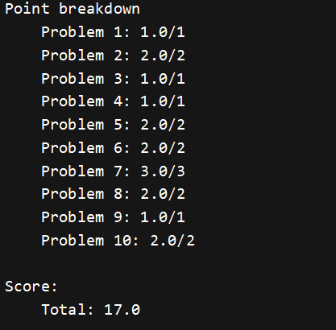

# Cats

## Typing

### P1

从paragraph这个列表中返回让select函数为true的第k项

```python
i = -1
for item in paragraphs:
    if select(item):
        i += 1
        if i == k:
            return item
return ''
```

### P2

实现select函数,对于传入的字符串,检查topic中的每一项是否是其子串(忽略大小写和标点符号),用到utils.py文件中的remove_punctuation和split函数来清楚字符串的不必要部分

```python
def select(sentence):
    sentence = remove_punctuation(sentence)
    words = split(sentence)
    for item in topic:
        for word in words:
            if lower(word) == item:
                return True
    return False
return select
```

### P3

实现计算精度的函数,传入typed(键入),参考值(reference),不忽略大小写和标点符号,但忽略空格制表符等

正确率 = 100% * (正确的个数) / (键入的单词个数)

```python
if len(typed_words) == 0 or len(reference_words) == 0:
    return 0.0
i, cor = 0, 0
while i < min(len(typed_words),len(reference_words)):
    if typed_words[i] == reference_words[i]:
        cor += 1
        i += 1
return 100.0 * cor / len(typed_words)
```

### P4

计算wpm(每分钟键入的单词数)的值,给定typed(键入的字符串),elapsed(流逝的时间)

公式 = (typed / 5) * (60 / elapsed)

```python
l = len(typed) / 5.0
t = 60.0 / elapsed
return l * t
```

## Autocorrect

### P5

传入用户输入的单词,纠正单词列表,纠正距离,如果**单词在纠正表里**直接返回,否则挨个比对,列表中每个单词与输入的最小距离,如果这个距离大于给定的纠正距离,就返回用户单词,否则返回第一个距离最小的单词

```pytho
ans, min_diff = "", 1e9
for vwords in valid_words:
    if vwords == user_word:
        return vwords
    diff = diff_function(user_word,vwords,limit)
    if diff < min_diff:
        min_diff = diff
        ans = vwords
if min_diff > limit:
    return user_word
else: return ans
```

### P6

实现shifty_shifts，这是一个需要两个字符串的diff 函数。它返回起始单词中必须更改的最小字符数，以便将其转换为目标单词。如果字符串的长度不相等，则长度差将添加到总数中。

注意如果必须更改的字符数已经超过limit的话,直接一个大于limit的数字就可以,以此来减少函数执行的时间

```python
def helper(s1,s2,cur_ch):
    if cur_ch > limit:
        return limit + 1
    if s1 == '' or s2 == '':
        return cur_ch + abs(len(s1) - len(s2))
    else:
        r = int(s1[0] != s2[0])
        return helper(s1[1:],s2[1:],cur_ch + r)
return helper(start,goal,0)
```

### P7

给定两个字符串start,goal,要求使用以下三种操作将start变为goal：

1. 往start中增加一个字符
2. 在start中删除一个字符
3. 对start中的某个字符进行替换

典型的编辑距离,正解是dp(但本人dp很菜,尤其用python写更菜),但这里是简化版本,题目给了一个限制,超过limit就可以直接返回一个大于limit的数,因此直接使用tree recursion也可以不超时：

对于start,从首字母开始与goal进行比较,每遇到一个不同的字符三种操作都尝试一遍：

1. 在start[i]前增加goal[i],然后比较start[i]和goal[i + 1]
2. 把start[i]删掉,然后比较start[i + 1]和goal[i]
3. 把start[i]换成goal[i],然后比较start[i + 1]和goal[i + 1]

不难看出最优解一定在某个增删改的序列中,当操作的步数大于limit的时候直接返回limit + 1, 可以在较短时间内求出最优解(或者最优解大于limit,关键点在于tree recursion的递归深度不会太深,所以不会栈溢出)

```python
def helper(s1,s2,cur_step):
    if cur_step > limit:
        return limit + 1
    elif s1 == "":
        return cur_step + len(s2)
    elif s2 == "":
        return cur_step + len(s1)
    elif s1[0] == s2[0]:
        return helper(s1[1:],s2[1:],cur_step)
    else:
        return min(helper(s1[1:],s2[1:],cur_step + 1),helper(s1[1:],s2,cur_step + 1),helper(s1,s2[1:],cur_step + 1))
return helper(start,goal,0)
```

## Multiplayer

### P8

用户每输入一个单词计算一遍和标准答案对比后的正确率,然后将当前用户id和正确率发送到服务器上

```python
i, right = 0,0
while i < min(len(typed),len(prompt)):
    if typed[i] == prompt[i]:
        right += 1
    else: break
    i += 1
right = right / len(prompt)
dic = {'id': user_id, 'progress': right}
send(dic)
return right
```

### P9

根据给定的数据构造数据抽象,times_per_player从头到尾给定每个用户完成每个单词的输入时间,计算出各个时间间隔,然后放入一个列表中返回. 如下:

times_per_player = [[1, 3, 5], [2, 5, 6]]

times = [[2, 2], [3, 1]]

```pyth
times = []
for p in times_per_player:
    t, i = [], 1
    while i < len(p):
        t.append(p[i] - p[i - 1])
        i += 1
    times.append(t)
return game(words,times)
```

### p10

题目要求找出每个单词被哪个用户输入的最快,并将对应单词放入对应用户的列表里,最后所有用户的列表形成一个列表返回,要求使用数据抽象的方式

1. 首先在一个大列表里创建player_indices个空列表
2. 遍历每个单词,用word_at的获取单词
3. 对每个单词,用time获取每个用户的输入时间
4. 找到最小的时间对应的用户编号,将该单词加入到列表的对应位置

```python
words = []
for i in player_indices:
    words.append([])
for w in word_indices:
    cur_word = word_at(game,w)
    best_pl, mintime = -1, 1e9
    for pl in player_indices:
        cur_time = time(game,pl,w)
        if cur_time < mintime:
            mintime = cur_time
            best_pl = pl
    words[best_pl].append(cur_word)
return words
```

## End



